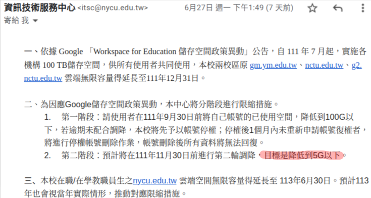

Starting this July, Google are going to change their storage policy for educational organizations, where many of these organizations are starting to limit their users in terms of individual storage space.

> **Google Workspace for Education 縮減儲存空間**
>
> Google的新政策將於今年7月生效，僅提供各機構 100TB 的儲存空間。
> Link: <https://support.google.com/a/answer/10431555?hl=zh-Hant>

> 

I supposed many are looking to download/sync their data to prevent data losses. But manual download from the browser is going to take a lot of work.

For lite users, Google Takeout ([https://takeout.google.com/](https://takeout.google.com/)) would probably be the best tool for this. But for a heavy user like me (few TB across multiple accounts), there is a much better tool -**rclone**- which is more powerful and flexible.

## Table of contents
1. What can rclone do?
2. Setting up rclone:
    * Advance setup: create your own Google App ClientID
3. Downloading your data: 
    * *lsd*     - list directories
    * *copy*
    * *sync*
    * *ncdu*    - interactive disk usage
4. Advanced usage:
    * *dedupe*
    * *mount*
    * *sync* between 2 cloud drives

